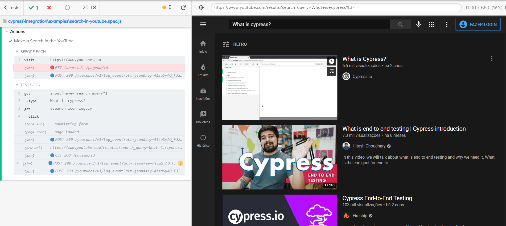

# Example of Cypress
It's a simple example using Cypress to open YouTube and search for the term 'What is cypress?' in the search field.

# What is Cypress?
It is a javascript framework for automated end-to-end testing.

For more information access the [DOCUMENTATION](https://docs.cypress.io)

# How to Use?

- Install packages -> npm install.
- Running the project by terminal -> npx cypress run.

- Running the project by a browser -> npx cypress open.
- Click in the exmaple 'search-in-youtube.spec.js'.

- This is the preview of the test when the same is finish.

